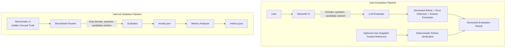

# Engineering AI Evaluator

A hybrid engineering solution evaluation system combining LLM-based reasoning with deterministic Python verification.

## Project Overview

Engineering solutions can look convincing while still containing incorrect formulas, flawed reasoning, arithmetic mistakes, unsupported assumptions, unit problems, or physically unreasonable conclusions. This applies both to LLM-generated work and to solutions written by students.

Engineering AI Evaluator reviews a user-provided engineering problem and candidate solution using a structured engineering rubric. It identifies meaningful errors, explains why they matter, and produces an improved or corrected solution. When the user supplies a trusted numerical value or unit, separate Python checks can compare those references with the final answer extracted from the candidate.

The system is an evaluator, not an authoritative engineering oracle. Its LLM judgments and generated corrections can be wrong and should be reviewed by a qualified person when decisions carry academic, safety, financial, or operational consequences.

## Current MVP Capabilities

- Accepts arbitrary user-entered engineering questions and student- or AI-generated candidate solutions.
- Supports five engineering domains.
- Applies a structured five-dimension Engineering Evaluation Rubric v1.
- Identifies errors and explains why they matter.
- Generates a corrected or improved solution.
- Extracts a final numerical answer and unit when one is clearly present.
- Accepts an optional user-supplied trusted numerical value and/or unit.
- Performs deterministic numerical comparison, including absolute error, percentage error, and a tolerance check.
- Performs normalized unit-string comparison.
- Handles missing configuration, provider failures, timeouts, and invalid structured responses through controlled evaluation errors.
- Includes an internal engineering benchmark, an automated benchmark runner, and an offline metrics analyzer.
- Includes automated tests for deterministic checks, benchmark integrity, and evaluator response reliability.
- Provides a Streamlit interface for the user workflow.

## Engineering Domains

- Fluid Mechanics
- Aerodynamics
- Thermodynamics
- Engineering Mathematics
- Basic Propulsion

## Hybrid Architecture

The system separates qualitative engineering evaluation from checks that can be computed directly.

### LLM responsibilities

- Interpret the candidate's reasoning.
- Evaluate the engineering approach, governing concepts, equations, and assumptions.
- Apply Rubric v1.
- Identify conceptual and reasoning errors and explain their consequences.
- Generate an improved or corrected solution.
- Extract a final numerical answer and unit when applicable.

### Python and deterministic responsibilities

- Compare an extracted candidate value with a user-supplied trusted value.
- Calculate absolute and percentage error.
- Apply the current numerical tolerance.
- Compare units after basic case and surrounding-whitespace normalization.
- Execute benchmark cases and calculate benchmark metrics.

This separation prevents an LLM-generated answer from being treated as trusted ground truth. In the normal user workflow, deterministic verification runs only for the trusted reference fields the user supplies. Without a trusted value or unit, the application returns the Rubric v1 LLM evaluation without claiming an independent numerical or unit verification.

## Rubric v1

Every candidate solution is evaluated across five dimensions:

1. **Problem Understanding** — whether the given information, requested result, and meaning of the problem were understood correctly.
2. **Engineering Method** — whether the selected principles, governing equations, formulas, approach, and assumptions are appropriate.
3. **Mathematical Execution** — whether substitution, algebra, arithmetic, equation manipulation, and numerical calculations are correct.
4. **Engineering Validity** — whether units, dimensions, signs, assumptions, magnitude, and physical behavior are reasonable.
5. **Final Response Quality** — whether the response answers the question clearly, correctly, relevantly, and with adequate support.

Each dimension receives one status:

- `correct`
- `partially_correct`
- `incorrect`
- `not_applicable`

The MVP does not calculate an arbitrary overall numerical score.

## Architecture Diagram



The benchmark runner reads the complete benchmark records, but sends only the domain, question, and candidate solution to the LLM evaluator. Reference answers, correctness labels, injected-error descriptions, assumptions, and expected error categories remain hidden from that call and are used afterward for validation and analysis.

## Benchmark and Evaluation Methodology

Benchmark v1 contains 10 controlled engineering cases: two cases in each supported domain. It includes:

- 4 intentionally correct candidate solutions.
- 6 intentionally incorrect candidate solutions.

The incorrect cases inject formula or method errors, mathematical execution errors, and conceptual misconceptions. The correct cases measure false-positive behavior—whether the evaluator invents errors in valid solutions. Expected error labels describe the intentionally injected root mistake rather than every possible downstream consequence.

The expected root-error labels and other benchmark ground truth are hidden from the LLM evaluator. Benchmark cases are evaluation data, not model training data.

## Initial Benchmark Results

**Initial Benchmark v1 — single run on 10 controlled cases**

| Metric | Result |
| --- | ---: |
| Evaluation completion rate | 90.00% (9/10) |
| Error detection rate | 83.33% (5/6 completed incorrect cases) |
| Root-category agreement rate | 50.00% (3/6) |
| False-positive rate | 0.00% (0/3 completed correct cases) |
| Correct-case clean rate | 100.00% (3/3) |

One correct case, `TH-002`, failed because the LLM returned an invalid structured response. `AE-001` was a genuine error-detection miss. In other incorrect cases, the evaluator sometimes detected that the solution was wrong but assigned a different rubric category from the intentionally injected root-error label.

These figures describe one run on a small, controlled benchmark. In particular, the 83.33% error detection rate is **not** evidence of general 83.33% engineering accuracy, and none of these results should be generalized beyond the tested cases.

## Testing

The repository currently has **38 passing local automated tests**. They cover:

- Deterministic absolute-error and percentage-error calculations.
- Inclusive tolerance behavior and zero-valued references.
- Unit normalization and comparison.
- Benchmark schema, composition, and data integrity.
- Controlled evaluator errors and structured-response validation.

The tests make no live LLM or provider API calls. They validate software behavior and data contracts; they do not prove that the evaluator is generally engineering-correct.

## Example: Dynamic Pressure

Given:

```text
rho = 1.225 kg/m^3
V = 50 m/s
```

An incorrect candidate uses:

```text
q = rho * V^2
q = 3062.5 Pa
```

The correct relationship is:

```text
q = 0.5 * rho * V^2
q = 1531.25 Pa
```

With `1531.25 Pa` supplied as the trusted reference, the LLM reasoning identifies the missing `0.5` factor as an **Engineering Method** error. The deterministic numerical comparison reports a 100% error, while the unit comparison still reports a match because both units are `Pa`.

This separation is intentional: correct units do not prove numerical or methodological correctness, and a numerical mismatch does not explain the engineering cause.

## Project Structure

```text
Engineering-ai-evaluator/
├── app.py                         # Streamlit user interface and optional trusted-reference checks
├── evaluator/
│   ├── llm_evaluator.py           # Prompt, structured schema, response validation, provider handling
│   ├── deterministic_checks.py    # Numerical error, tolerance, and unit-string checks
│   └── pipeline.py                # Single-case benchmark pipeline helper
├── benchmark/
│   ├── questions.json             # Controlled Benchmark v1 cases and hidden reference data
│   ├── run_benchmark.py           # Automated live benchmark runner
│   ├── results.json               # Stored case-level output from the latest benchmark run
│   ├── analyze_results.py         # Offline metrics and diagnostic analyzer
│   └── metrics.json               # Stored aggregate metrics and case diagnostics
├── tests/
│   ├── test_benchmark_data.py
│   ├── test_deterministic_checks.py
│   └── test_llm_evaluator_reliability.py
├── requirements.txt
└── README.md
```

## Local Setup

macOS or Linux:

```bash
git clone https://github.com/Samarth7171/Engineering-ai-evaluator.git
cd Engineering-ai-evaluator
python3 -m venv .venv
source .venv/bin/activate
pip install -r requirements.txt
```

Create a local `.env` file in the project root:

```dotenv
OPENROUTER_API_KEY=your_key_here
```

Never commit `.env` or expose API keys in source code, screenshots, logs, or documentation.

Start the application:

```bash
streamlit run app.py
```

## Running Tests

With the virtual environment active:

```bash
python -m pytest
```

## Running the Benchmark

Run all Benchmark v1 cases:

```bash
python benchmark/run_benchmark.py
```

This command makes live LLM requests through the configured provider, can consume API quota, and may take time. It writes case-level output to `benchmark/results.json`.

Analyze an existing results file:

```bash
python benchmark/analyze_results.py
```

The analyzer runs offline on `benchmark/results.json` and writes aggregate metrics and case diagnostics to `benchmark/metrics.json`.

## Current Limitations

- Benchmark v1 contains only 10 controlled cases.
- LLM evaluation is probabilistic and may miss errors, misclassify them, or return invalid output.
- External provider latency, availability, and behavior affect reliability.
- Numerical tolerance is a fixed 2% MVP default, not a universal engineering standard.
- Unit verification is normalized string comparison only.
- Physically equivalent units and conversions are not fully recognized.
- Symbolic final-answer extraction is limited.
- The corrected or improved solution is AI-generated and is not independently verified ground truth.
- The system does not currently include RAG, SymPy verification, or a full dimensional-analysis layer.
- Initial benchmark results should not be generalized beyond the tested cases.

## Roadmap

- Expand the controlled benchmark across domains, difficulty levels, and error types.
- Improve rubric and root-category consistency using benchmark evidence.
- Add stronger unit handling, including carefully scoped equivalent-unit support.
- Evaluate SymPy-based verification where it provides clear value.
- Improve symbolic answer extraction.
- Deploy the application with appropriate configuration and operational safeguards.
- Continue UI and accessibility improvements.
- Consider RAG later only if a validated use case requires trusted external engineering references.

## Tech Stack

- Python
- Streamlit
- OpenAI-compatible Python client
- OpenRouter
- pytest
- JSON structured outputs
- Git and GitHub

## Author and Purpose

**Samarth Ghorpade** — B.Tech Aerospace Engineering

This project combines engineering-domain knowledge, Python software development, structured LLM evaluation, deterministic verification, benchmark design, and AI-system testing in a practical portfolio project.
